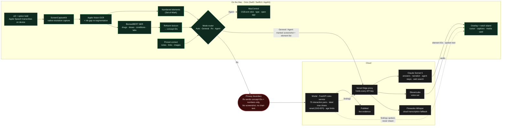

# Octo architecture

```mermaid
flowchart LR
    subgraph mac["On the Mac · Octo (Swift / SwiftUI / AppKit)"]
        direction TB
        hotkey["ctrl + option held<br/>Apple Speech transcribes on device"]
        capture["ScreenCaptureKit<br/>native-resolution capture"]
        ocr["Apple Vision OCR<br/>+ ink-gap re-segmentation"]
        som["Numbered elements<br/>(Set-of-Mark)"]
        ner["BiomedBERT NER<br/>drugs · doses · conditions · labs"]
        rxnorm["RxNorm lexicon<br/>→ concept IDs"]
        router{"Mode router<br/>Auto · General · Rx · Agent"}
        context["Pinned context<br/>notes · links · images"]
        overlay["Overlay + notch island<br/>cursor · captions · media card"]
        macctl["MacControl<br/>CGEvent click · type · open app"]

        hotkey --> capture --> ocr
        ocr --> som
        ocr --> ner --> rxnorm
        som --> router
        rxnorm --> router
        context --> router
        router -->|Agent| macctl
    end

    boundary(["Privacy boundary<br/>Rx sends concept IDs + numbers only.<br/>No screenshot, no chart text."])

    subgraph cloud["Cloud"]
        direction TB
        proxy["Vercel Edge proxy<br/>holds every API key"]
        claude["Claude Sonnet 5<br/>answers · narration · agent steps · web search"]
        rules["Modal · FastAPI rules service<br/>75 interaction pairs · label max doses<br/>renal (CKD-EPI) · age limits"]
        pubmed["PubMed<br/>live evidence"]
        eleven["ElevenLabs<br/>voice out"]
        whisper["Fireworks Whisper<br/>cloud transcription fallback"]

        proxy --> claude
        proxy --> eleven
        proxy --> whisper
        rules --> pubmed
    end

    router -->|General / Agent:<br/>marked screenshot + element list| proxy
    router -->|Rx| boundary --> rules
    rules -->|findings| proxy
    claude -->|element IDs · spoken text| overlay
    eleven -->|audio| overlay
    rules -.->|findings spoken,<br/>never drawn| overlay

    classDef local fill:#0f2a1f,stroke:#4ade80,color:#e8fff1
    classDef cloudy fill:#1a1a1a,stroke:#9ca3af,color:#f3f4f6
    classDef guard fill:#3b0d0d,stroke:#f87171,color:#fff1f1
    class hotkey,capture,ocr,som,ner,rxnorm,router,context,overlay,macctl local
    class proxy,claude,rules,pubmed,eleven,whisper cloudy
    class boundary guard
```
